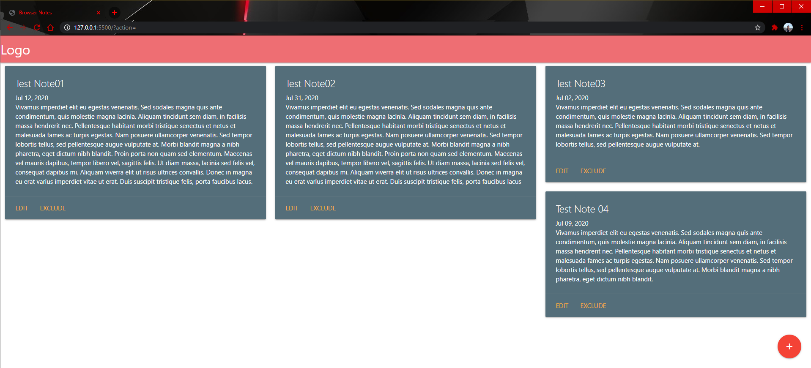

# BrowserNotes
Project to create a page with notes to be stored in local storage of the browser, making it acessible in next acesses. And there is no necessary to login or create account o access it.

Deployed to GH Pages:  [GH Pages] https://ikaroamorim.github.io/BrowserNotes/

## Contributing
Pull requests are welcome. For major changes, please open an issue first to discuss what you would like to change.

## License
[MIT] (https://opensource.org/licenses/MIT)